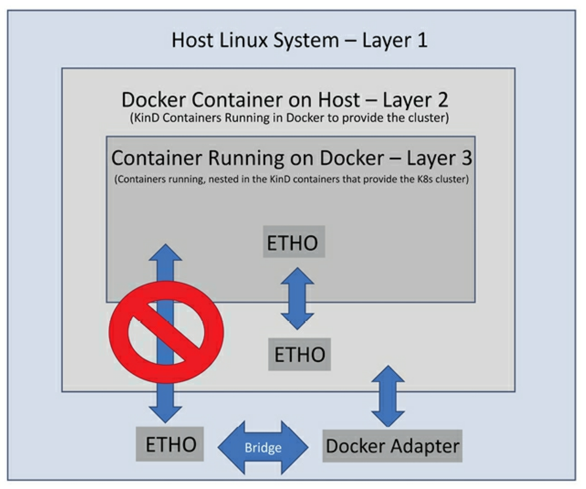

# My notes from "Kubernetes - An Enterprise Guide" by Marc Boorshtein and Scott Surovich


<details>
<summary>Book Resources</summary>

- [Book Code](https://github.com/PacktPublishing/Kubernetes-An-Enterprise-Guide-Third-Edition)
- [Youtube Channel](https://www.youtube.com/channel/UCK__yS63yrSI8vavJzainEQ)

</details>

<!-- omit in toc -->
## Helpful Commands

```bash
# Docker commands
docker ps -a              # Check container status

# KinD commands
kind get clusters
kind get nodes
kind create cluster --name custom-cluster
kind delete cluster --name custom-cluster
kind create cluster --name my-ha-cluster --config kind-multi-control-plane.yaml
kind create cluster --name my-ha-cluster --config kind-multi-control-plane.yaml --retain  # Keep the cluster even if the command fails
kind export logs --name my-ha-cluster

# Kubernetes commands
kubectl get nodes          # Check Kubernetes node status
```


<!-- omit in toc -->
## Contents

- [1. Docker and Container Essentials](#1-docker-and-container-essentials)
  - [Why Kubernetes removed Docker](#why-kubernetes-removed-docker)
  - [Docker vs Moby](#docker-vs-moby)
  - [Understanding Docker](#understanding-docker)
    - [Containers are Ephemeral](#containers-are-ephemeral)
    - [Docker Images](#docker-images)
    - [Persistent data](#persistent-data)
    - [Accessing services running in containers](#accessing-services-running-in-containers)
  - [Using the Docker CLI](#using-the-docker-cli)
    - [`docker run`](#docker-run)
    - [`docker ps`](#docker-ps)
    - [`docker start` and `docker stop`](#docker-start-and-docker-stop)
    - [`docker attach`](#docker-attach)
    - [`docker exec`](#docker-exec)
    - [`docker logs`](#docker-logs)
    - [`docker rm`](#docker-rm)
    - [`docker pull/run`](#docker-pullrun)
    - [`docker build`](#docker-build)
- [2. Deploying Kubernetes Using KinD (Kubernetes in Docker)](#2-deploying-kubernetes-using-kind-kubernetes-in-docker)
  - [Introducing Kubernetes components and objects](#introducing-kubernetes-components-and-objects)
    - [Interacting with a cluster](#interacting-with-a-cluster)
  - [Using development clusters](#using-development-clusters)
  - [Working with a basic KinD Kubernetes cluster](#working-with-a-basic-kind-kubernetes-cluster)
  - [Understanding the node image](#understanding-the-node-image)
  - [KinD and Docker networking](#kind-and-docker-networking)
    - [Keeping track of the nesting dolls](#keeping-track-of-the-nesting-dolls)
  - [Installing KinD](#installing-kind)
    - [Installing `kubectl`](#installing-kubectl)
    - [Installing the KinD binary](#installing-the-kind-binary)
    - [Installing other required executables - `Helm` and `jq`](#installing-other-required-executables---helm-and-jq)
  - [Creating a KinD cluster](#creating-a-kind-cluster)
    - [Creating a simple cluster](#creating-a-simple-cluster)
    - [Deleting a cluster](#deleting-a-cluster)
    - [Creating a cluster config file](#creating-a-cluster-config-file)
    - [Multi-node cluster configuration](#multi-node-cluster-configuration)


## 1. Docker and Container Essentials

Docker is not tied to Kubernetes: you do not need Docker to run Kubernetes and you don't need it to create containers.

### Why Kubernetes removed Docker

- Kubernetes removed suppot for Docker in version 1.24 (2022) as a supported container runtime.
- You can still create new containers using Docker and they will run on any runtime that supports the **Open Container Initiative (OCI)** specification.
- Docker contains multiple pieces to support its own user experience, e.g. remote API, user experience.
- Kubernetes only quires one component, `dockerd`, which is the runtime that manages the containers.
- Docker does not conform to the **Container Runtime Interface (CRI)** standard, which was introduced to easily integrate container runtimes in Kubernetes.
- Since Docker doesn't comply, the Kubernetes team has had extra work that only caters to supporting Docker.

When it comes to local testing, when you build a container on Docker, and the container successfully runs on your Docker runtime system, it will run on a Kubernetes that does not use Docker as the runtime.

Kubernetes supports a number of runtimes in place of Docker. Two commonly used runtimes are:
- containerd
- CRI-O

See [here](https://github.com/kubernetes/community/blob/master/contributors/devel/sig-node/container-runtime-interface.md) for a list of runtimes that support the CRI standard.

### Docker vs Moby

| Feature            | Docker                                                                               | Moby                                                                                                          |
| ------------------ | ------------------------------------------------------------------------------------ | ------------------------------------------------------------------------------------------------------------- |
| Development        | The primary contributor is Docker, with some community support                       | It is open-source software with heavy community development and support                                       |
| Project Scope      | The complete platform that includes all components to build and run containers       | It is a modular platform for building container-based components and solutions                                |
| Ownership          | It is a branded product, offered by Docker, Inc.                                     | It is an open-source project that is used to build various container solutions                                |
| Configuration      | A full default configuration is included to make it easy for users to use it quickly | It has more available customizations, providing users with the ability to address their specific requirements |
| Commercial Support | It offers full support, including enterprise support                                 | It is offered as open-source software; there is no support direct from the Moby project                       |

### Understanding Docker

#### Containers are Ephemeral

- Containers exist temporarily and can be terminated/restarted without consequences
- Changes to running containers are written to a temporary **container layer** (directory on host filesystem)
- Docker uses a **storage driver** to manage this container layer
- The container layer persists until the container is removed

Despite containers being temporary and read-only, data modification is possible through:
- **Image layering** - interconnected layers functioning as a filesystem
- This architecture allows changes while keeping the underlying image immutable

#### Docker Images

- Docker images consist of multiple layers with associated metadata JSON files

See [Docker Image Specification](https://github.com/moby/docker-image-spec/blob/main/spec.md)

A container runs with a **container layer** atop the base **image layer**.


Data added to containers stays in the temporary container layer while the container runs.

**File Handling in Layered Systems**
- Docker uses **copy-on-write**: files aren't duplicated in higher layers if they exist in lower layers
- When a file needs modification, the new version is stored in the container's temporary layer

#### Persistent data

Data persistence is achieved by incoporating a Docker volume, which allows data to be stored outside the container, enabling it to persist even if the container is removed.

#### Accessing services running in containers

Containers do not connect to a network directly. Instead, containers talk through the Docker host system using a bridge *network address translation (NAT)*.

This means you must expose ports for each container to allow access to the services running inside the container.

On a Linux-based system, `iptables` has rules to forward traffic to the Docker daemon. Docker manages these rules for you.

What is `iptables`? `iptables` is used to manage network traffic and keep it secure within a cluster.


### Using the Docker CLI

#### `docker run`

```bash
docker run -d bitnami/nginx:latest
```
- `-d` runs the container in detached mode


Containers will have a random name. Specify the `--name` option to give a container a specific name.

```bash
docker run -d --name my-nginx bitnami/nginx:latest
```

#### `docker ps`

List all running containers:

```bash
docker ps
```


**Note:** The `ps` stands for "process status".

View status of all containers (running and stopped):

```bash
docker ps -a
```


Docker exit codes:

| Exit Code | Description                                                                           |
| --------- | ------------------------------------------------------------------------------------- |
| 0         | The command was executed successfully without any issues.                             |
| 1         | The command failed due to an unexpected error.                                        |
| 2         | The command was unable to find the specified resource or encountered a similar issue. |
| 125       | The command failed due to a Docker-related error.                                     |
| 126       | The command failed because the Docker binary or script could not be executed.         |
| 127       | The command failed because the Docker binary or script could not be found.            |
| 128+      | The command failed due to a specific Docker-related error or exception.               |

#### `docker start` and `docker stop`

Run `docker start <container_id/name>` to start a stopped container.


#### `docker attach`

Run `docker attach <container_id/name>` to attach to a running container. 

When running docker attach, it's likely you will see a blank screen. This is because the container is running in the background and not producing any output.

When you attach, you will only be able to interact with the running process, and the only output you will see is being sent to standard output.

Be careful when using `docker attach` as it can cause issues with the running process. For example, if you run `CTRL+C`, it will stop the process and exit the container. To exit from an attached container without stopping it, use `CTRL+P` and then `CTRL+Q`. This will detach you from the container and leave it running in the background.

**Note:** As of 5/2025, issuing `CTRL+P` and then `CTRL+Q` does not work when running the command in WSL. For whatever reason, `CTRL+Q` doesn't get recognized. See [Docker CLI hangs when attempting to detach from a container](https://github.com/docker/cli/issues/3385).

No good workaround exists for this issue. The best option is to run the container in the background and use `docker exec` to access it.

#### `docker exec`

Run `docker exec -it <container_id/name> <command>` to run a command inside a running container.

The option `i` is for interactive mode, and `t` is for terminal mode. This allows you to run commands inside the container as if you were logged into the container. 

```bash
docker exec -t test-nginx bash
```
**Output:**  


**Note:**
- The prompt change from the original username and hostname to `root@<container_id>` indicates that you are now inside the container.
- The current working directory changed from `~` to `/app`

#### `docker logs`

Run `docker logs <container_id/name>` to retrieve the logs from a container.

Log files are often the only way to troubleshoot issues with a container. 

```bash
docker logs <container_id/name>
```
**Output:**  


The following table lists the options for viewing logs:

| Log Options | Description                                                                                                                                           |
| ----------- | ----------------------------------------------------------------------------------------------------------------------------------------------------- |
| -f          | Follow the log output (can also use `--follow`).                                                                                                      |
| --tail xx   | Show the log output starting from the end of the file and retrieve `xx` lines.                                                                        |
| --until xxx | Show the log output before the `xxx` timestamp.<br>`xxx` can be a timestamp (e.g., 2020-02-23T18:35:13).<br>`xxx` can be a relative time (e.g., 60m). |
| --since xxx | Show the log output after the `xxx` timestamp.<br>`xxx` can be a timestamp (e.g., 2020-02-23T18:35:13).<br>`xxx` can be a relative time (e.g., 60m).  |

**Example:** Using the `--since` option   


#### `docker rm`

Run `docker rm <container_id/name>` to remove a container. During container image testing, you may need to remove a container if you want a new container to be created with the same name.

```bash
docker rm test-nginx
```
**Note:** You can also add the `--rm` option to your Docker command to automatically remove the image after it is stopped.

When removing a container that has a volume attached, it's good practice to add the `-v` option to remove the volume as well. 

#### `docker pull/run`

`docker pull` and `docker run` are used to pull an image or run an image. If you try to run a container that doesn't exist, Docker will initiate a `pull` request to get the container and then run it.

When running a pull, be sure to specify the architecture:

```bash
docker pull --platform=linux/amd64 ubuntu:latest
```

#### `docker build`

Similar to `pull` and `run`, `docker build`  will attempt to build the image based on the host's architecture. If you want to build for a different architecture, use the `buildx` subcommand:

```bash
docker buildx build --platform linux/arm64 --tag docker.io/mlbiam/openunison-kubernetes-operator --no-cache -f ./src/main/docker/Dockerfile .
```

## 2. Deploying Kubernetes Using KinD (Kubernetes in Docker)

The tool KinD (Kubernetes in Docker) is a tool for running Kubernetes clusters in Docker containers. It is primarily designed for testing Kubernetes itself, but it can also be used for local development and CI/CD workflows.

### Introducing Kubernetes components and objects

**Common Kubernetes components:**  


#### Interacting with a cluster

Use the `kubectl` command:  

| Kubectl command                                                   | Description                                                                                                                                                    |
| ----------------------------------------------------------------- | -------------------------------------------------------------------------------------------------------------------------------------------------------------- |
| `kubectl get <object>`                                            | Retrieves a list of the requested object.<br>Example: `kubectl get nodes`.                                                                                     |
| `kubectl create -f <manifest-name>`                               | Creates the objects in the `include` manifest that is provided. `create` can only create the initial objects; it cannot update the objects.                    |
| `kubectl apply -f <manifest-name>`                                | Deploys the objects in the `include` manifest that is provided. Unlike the `create` option, the `apply` command can update objects, as well as create objects. |
| `kubectl patch <object-type> <object-name> -p {patching options}` | Patches the supplied `object-type` with the options provided.                                                                                                  |

**Note:** `kubectl` stands for **Kubernetes Control**.

### Using development clusters

The following tools have benefits and limitations for conducting testing on local systems:
- Docker Desktop
- K3s
- KinD
- kudbeadm
- minikube
- Rancher Desktop

**KinD**:  
To truly get into Kubernetes, you need to have a cluster that has at least a control plane and a single worker node. You may want to test scenarios wher you drop a worker node. In this case you need to create a cluster that has a control plane and three worker nodes. To create these cluster types, you can use a project from the Kubernetes **Special Interest Group (SIG)**, called **KinD**.

https://github.com/kubernetes-sigs/kind

**Note:** KinD is not a production-grade solution. It is only meant for testing and development purposes. 

### Working with a basic KinD Kubernetes cluster

KinD can be seen as comprising a single Docker container, responsible for running both a control plane node and a worker node, creating a Kubernetes cluster. 

KinD packages all Kubernetes objects into a unified image, referred to as a *node image*. The node image includes all the necessary components to run either a single-node or multi-node cluster. 

You can utilize Docker to execute command within a control plane node container to examine the process list:

Example when running `docker exec cluster01-worker ps -ef`:


**Note:** Host process list showing control plane components: `API-Server`, `kube-scheduler`, `kube-controller-manager`, and `etcd` processes.

You can `exec` into a worker node to check its components:


**Note:** Host process list showing worker node components: `kubelet`, `kube-proxy`, and `containerd` processes.

Both KinD nodes (the control plane node and worker node) have an additional component that is not part of standard Kubernetes installations, referred to as **Kindnet**. Kindnet is a **Container Network Interface (CNI)** solution included in a default KinD deployment and provides networking to a Kubernetes cluster.

The Kubernetes CNI is a specification that allows Kubernetes to use different networking solutions, e.g. Calico, Flannel, Cilium, Kindnet, and more.

Kindnet serves as the default CNI, you can deactivate it nad use an alternative, suchas Calico. While Kindnet would work for most tasks in this book, it isn't a CNI you will see in a real-world Kubernetes cluster.

To show the complete cluster, including all components, run:

```bash
kubectl get pods --all
```


In addition to the base cluster components, you may notice a running pod in a namespace called `local-path-storage`, along with a pod named `local-path-provisioner`. This pod runs one of the add-ons included with KinD, providing the luster the ability to auto-provision `PersistentVolumeClaims`.

The local provisioner is great for testing, but it is not a production-grade solution. Most production clusters provide persistent storage to developers. Usually the storage is backed by systems based on block storage, e.g. S3 (Simple Storage Service), or NFS (Network File System).

There are a few API objects, `CSIdrivers` , `CSInodes`, and `StorageClass`, that are used by the cluster to provide access to the backend storage system. Once installed and configured, pods consume the storage using `PersistentVolumes` and `PersistentVolumeClaims` objects.

Storage objects are important to understand. When they were first released, they were difficult for most people to test, since they weren't included in most Kubernetes development offerings.

KinD recognized this limitation and chose to bundle a project from Rancher Labs, now part of SUSE, called `local-path-provisioner`, which is built upon the Kubernetes local persistent volumes framework, introduced in Kubernetes 1.10.

Why would anyone need an add-on, since Kubernetes has native support for local host persistent volumes? While local support has been added, Kubernetes does not provide a way to auto-provision the local persistent volumes. While the **CNCF (CLoud Native Computing Foundation)** offers an auto-provisioner, it must be installed and configured as a separate Kubernetes component. KinD's provisioner removes this configuration, so you can use persistent volumes easily on development clusters.

Rancher's project provides:
- Auto-creation of `PersistentVolumes` when a `PersistentVolumeClaim` is created
- A default `StorageClass` named standard

The `local-path-provisioner` adds a feature to KinD clusters that greatly expands potential test scenarios you can run. Without the ability to auto-provision persistent disks, it would be a challenge to test deployments that require persistent disks.

With the help of Rancher, KinD provides a solution to allow you to experiment with dynamic volumes, storage classes, and other storage tests that would otherwise be impossible to run outside of an expensive home lab or data center.

Knowing how to use persistent sotrage in Kubernetes is a great skill to have.

### Understanding the node image

In KinD (Kubernetes in Docker), the **node image** is a special Docker image that acts like a full Kubernetes node. It's what allows KinD to run entire Kubernetes clusters inside regular Docker containers.

This is impressive because normally, Docker containers are very lightweight and *don’t* include key parts of a full Linux system — like **systemd** (the system manager that controls services and startup processes) and other low-level components that Kubernetes usually needs. KinD overcomes this by building a custom node image that bundles just enough of these missing pieces, so Kubernetes can run correctly inside a container environment that wasn’t really designed for it.

KinD starts with a base image, which is an image the team has developed that contains everything required for Docker, Kubernetes, and `systemd`. This node image is based on a base `Ubuntu` image. 

### KinD and Docker networking

KinD relies on Docker and Red Hat's `Podman` as the container engine to run cluster nodes. Clusters have the same networking constraints associated with Docker containers. These limitations may introduce complications when attempting to test containers from other machines on your network.

> `Podman` is an alternative that KinD now supports. It's an open-source offering that is meant to replace Docker as a runtime engine. It offers many advantages over Docker, such as enhanced security and not requiring a system daemon. However, it also adds complexity for people who are new to containers.

When you install KinD on a Docker host, a new Docker bridge network is created, called `kind`. This bridge resolves issues with the default Docker bridge network. When running additional containers on the KinD network, you need to add `--net=kind` to the `docker run` command. 

Apart from Docker networking considerations, you must also consider the Kubernetes CNI (Container Network Interface). KinD supports multiple CNI interfaces, including KindNet, Calico, and Cilium. Officially, Kindnet is the only CNI they will support, but you do have the option to disable the default Kindnet installation, which will create a cluster without a CNI installed.

After the cluster is created, you can install a different CNI, such as Calico or Cilium. Since many enterprise clusters use Tigera's Calico, we will use it in this book.

#### Keeping track of the nesting dolls

Since KinD involves a container-in-container approach, it's easy to lose track of the communication paths between your host, Docker, and the Kubernetes nodes.

There are three layers of containers:



If you wish to communicate between the host and a container within the KinD cluster, you will need to traverse the Docker layer.

Let's say you want to deploy a web server to your Kubernetes cluster. After successfully deploying an ingress controller within the KinD cluster, you want to test the website using Chrome on another workstation on your network, but the browser fails to connect.

The reason for this failure is that the web server's pod operates at layer 3 and cannot directly receive traffice from the host or network machines. To access, you must forward traffic from the Docker layer to the KinD layer by enabling port forwarding.


### Installing KinD

The book provides the following script to deploy all components of KinD: [create-cluster.sh](https://github.com/PacktPublishing/Kubernetes-An-Enterprise-Guide-Third-Edition/blob/main/chapter2/create-cluster.sh)

The sections that follow cover manually installing KinD and its components.

#### Installing `kubectl`

When using Ubuntu, you can run it by running `snap install`:

```bash
sudo snap install kubectl --classic
```


**Note:** You won't be able to install via `apt` out of the box:  


You can also download `kubectl` directly from Google:

```bash
curl -LO https://storage.googleapis.com/kubernetes-release/release/`curl -s https://storage.googleapis.com/kubernetes-release/release/stable.txt`/bin/linux/amd64/kubectl
chmod +x ./kubectl
sudo mv ./kubectl /usr/local/bin/kubectl
```


#### Installing the KinD binary

The KinD binary is a single executable used for creating and deleting clusters.

GitHub Repo for release download: https://github.com/kubernetes-sigs/kind

The following commands download the latest version of the `kind` executable and installs it in `/usr/bin`:

```bash
curl -Lo ./kind https://github.com/kubernetes-sigs/kind/releases/download/v0.22.0/kind-linux-amd64
chmod +x ./kind
sudo mv ./kind /usr/bin
```


The `kind` command can:
- Create and delete clusters
- Create a custom build base and node images
- Export `kubeconfig` or log files
- Retrieve clusters, nodes, or `kubeconfig` files
- Load images into nodes

#### Installing other required executables - `Helm` and `jq`

The following commands install `Helm` and `jq`:

```bash
curl -fsSL -o get_helm.sh https://raw.githubusercontent.com/helm/helm/master/scripts/get-helm-3
chmod 700 get_helm.sh
./get_helm.sh
sudo snap install jq --classic
```


**Note:**  
- `Helm` is a package manager for Kubernetes.
- `jq` is a command-line JSON processor and allows you to extract, filter, transform, and format JSON data.

### Creating a KinD cluster

#### Creating a simple cluster

To create a simple cluster that runs the control plane and a worker node in a single container, you only need to execute `kind` with the `create cluster` option.

This command creates a cluster named `kind`, encompassing all the necessary components within a single Docker container. The Docker container itself will be assigned the name `kind-control-plane`.

You can use the `--name` option to specify a different name for the cluster. 

```bash
kind create cluster --name custom-cluster
```


To verify cluster creation, run `kubectl get nodes`:


#### Deleting a cluster

```bash
kind delete cluster --name custom-cluster 
```


If you run `kind delete cluster` without the `--name` option, it will attempt to delete the default cluster named `kind`.

#### Creating a cluster config file

THe following config file can be used to create a KinD cluster:

```yaml
kind: Cluster
apiVersion: kind.x-k8s.io/v1alpha4
runtimeConfig:
  "authentication.k8s.io/v1beta1": "true"
  "admissionregistration.k8s.io/v1beta1": true
featureGates:
  "ValidatingAdmissionPolicy": true
networking:
  apiServerAddress: "0.0.0.0"
  disableDefaultCNI: true
  apiServerPort: 6443
  podSubnet: "10.240.0.0/16"
  serviceSubnet: "10.96.0.0/16"
nodes:
- role: control-plane
  extraPortMappings:
  - containerPort: 2379
    hostPort: 2379
  extraMounts:
  - hostPath: /sys/kernel/security
    containerPath: /sys/kernel/security
- role: worker
  extraPortMappings:
  - containerPort: 80
    hostPort: 80
  - containerPort: 443
    hostPort: 443
  - containerPort: 2222
    hostPort: 2222
  extraMounts:
  - hostPath: /sys/kernel/security
    containerPath: /sys/kernel/security
```
[Source](https://github.com/PacktPublishing/Kubernetes-An-Enterprise-Guide-Third-Edition/blob/main/chapter2/cluster01-kind.yaml)


| Config Options          | Option Details                                                                                                                                                                                                                                                                                                          |
| ----------------------- | ----------------------------------------------------------------------------------------------------------------------------------------------------------------------------------------------------------------------------------------------------------------------------------------------------------------------- |
| `apiServerAddress`      | This configuration option tells the installation what IP address the API server will listen on. By default, it will use `127.0.0.1`, but since we plan to use the cluster from other networked machines, we have selected to listen on all IP addresses.                                                                |
| `disableDefaultCNI`     | This setting is used to enable or disable the Kindnet installation. The default value is `false`, but since we want to use Calico as our CNI, we need to set it to `true`.                                                                                                                                              |
| `podSubnet`             | Sets the CIDR range that will be used by pods.                                                                                                                                                                                                                                                                          |
| `serviceSubnet`         | Sets the CIDR range that will be used by services.                                                                                                                                                                                                                                                                      |
| `Nodes`                 | This section is where you define the nodes for the cluster. For our cluster, we will create a single control plane node and a single worker node.                                                                                                                                                                       |
| `- role: control-plane` | The role section allows you to set options for nodes. The first role section is for the `control-plane`.                                                                                                                                                                                                                |
| `- role: worker`        | This is the second node section, which allows you to configure options that the worker nodes will use. Since we will deploy an Ingress controller, we have also added additional ports that will be used by the NGINX pod.                                                                                              |
| `extraPortMappings`     | To expose ports to your KinD nodes, you need to add them to the `extraPortMappings` section of the configuration. Each mapping has two values, the container port and the host port. The host port is the port you would use to target the cluster, while the container port is the port that the container listens on. |

#### Multi-node cluster configuration

If you only want a multi-node cluster without any extra options, you can create a simple config file that lists the number and node types you want.

```yaml
kind: Cluster
apiVersion: kind.x-k8s.io/v1alpha4
nodes:
- role: control-plane
- role: control-plane
- role: control-plane
- role: worker
- role: worker
- role: worker
```

Introducing multiple control plane servers adds complexity since the `kubectl` config file can only target a single host or IP. To make this solution work, you need to add a *load balancer* in front of the control plane nodes. When you deploy multiple control plane nodes, KinD creates an additional container running a `HAProxy` load balancer.

> `HAProxy` only load balances the control plane nodes. It does not load balance the worker nodes.

```bash
kind create cluster --name my-ha-cluster --config kind-multi-control-plane.yaml
```

Note below how the installation automatically creates a load balancer for the control plane nodes:


However, note the error message in the screenshot. To diagnose the issue, you can re-run the command with the `--retain` option, which will keep the cluster even if it fails to create. This allows you to troubleshoot the issue without losing the cluster. From there, you can export the logs to a file and view them to see what went wrong:

```bash
kind create cluster --name my-ha-cluster --config kind-multi-control-plane.yaml --retain
kind export logs --name my-ha-cluster
```

When viewing the log file, `less /tmp/687778924/my-ha-cluster-worker2/kubelet.log`: 
```bash
Jun 16 10:09:11 my-ha-cluster-worker2 kubelet[469]: E0616 10:09:11.021539     469 dynamic_cafile_content.go:166] "Failed to watch CA file, will retry later" err="error creating fsnotify watcher: too many open files"
```

See:  
- [GitHub: Issue during creating kind cluster with multiple control-plan](https://github.com/kubernetes-sigs/kind/issues/3128?)
- [KinD Known Issues: Pod errors due to “too many open files"](https://kind.sigs.k8s.io/docs/user/known-issues/#pod-errors-due-to-too-many-open-files)

The fix in my case was to increase the number of `inotify` instances to 512 (defaults is 128):

```bash
sudo sysctl fs.inotify.max_user_instances=512
```

Result:

```bash
╭─( ~/LearningKubernetes/books/kubernetes_enterprise_guide/ch02 [main…]
╰╴% kind create cluster --name my-ha-cluster --config kind-multi-control-plane.yaml --retain
Creating cluster "my-ha-cluster" ...
 ✓ Ensuring node image (kindest/node:v1.29.2) 🖼 
 ✓ Preparing nodes 📦 📦 📦 📦 📦  
 ✓ Configuring the external load balancer ⚖️ 
 ✓ Writing configuration 📜 
 ✓ Starting control-plane 🕹️ 
 ✓ Installing CNI 🔌 
 ✓ Installing StorageClass 💾 
 ✓ Joining more control-plane nodes 🎮 
 ✓ Joining worker nodes 🚜 
Set kubectl context to "kind-my-ha-cluster"
You can now use your cluster with:

kubectl cluster-info --context kind-my-ha-cluster

Thanks for using kind! 😊
```

Verify cluster status:

```bash
╭─( ~/LearningKubernetes/books/kubernetes_enterprise_guide/ch02 [main…]
╰╴% kubectl cluster-info --context kind-my-ha-cluster                                       
Kubernetes control plane is running at https://127.0.0.1:35387
CoreDNS is running at https://127.0.0.1:35387/api/v1/namespaces/kube-system/services/kube-dns:dns/proxy

To further debug and diagnose cluster problems, use 'kubectl cluster-info dump'.

╭─( ~/LearningKubernetes/books/kubernetes_enterprise_guide/ch02 [main…]
╰╴% kubectl get nodes                                                                       
NAME                           STATUS   ROLES           AGE   VERSION
my-ha-cluster-control-plane    Ready    control-plane   73s   v1.29.2
my-ha-cluster-control-plane2   Ready    control-plane   42s   v1.29.2
my-ha-cluster-control-plane3   Ready    control-plane   30s   v1.29.2
my-ha-cluster-worker           Ready    <none>          19s   v1.29.2
my-ha-cluster-worker2          Ready    <none>          20s   v1.29.2
my-ha-cluster-worker3          Ready    <none>          20s   v1.29.2

╭─( ~/LearningKubernetes/books/kubernetes_enterprise_guide/ch02 [main…]
╰╴% docker ps -a
CONTAINER ID   IMAGE                                COMMAND                  CREATED         STATUS         PORTS                       NAMES
11753632a37c   kindest/node:v1.29.2                 "/usr/local/bin/entr…"   4 minutes ago   Up 4 minutes   127.0.0.1:40999->6443/tcp   my-ha-cluster-control-plane
37b710d7c5ff   kindest/haproxy:v20230606-42a2262b   "haproxy -W -db -f /…"   4 minutes ago   Up 4 minutes   127.0.0.1:42667->6443/tcp   my-ha-cluster-external-load-balancer
530d7fc78c7a   kindest/node:v1.29.2                 "/usr/local/bin/entr…"   4 minutes ago   Up 4 minutes                               my-ha-cluster-worker
9fd22616e1f1   kindest/node:v1.29.2                 "/usr/local/bin/entr…"   4 minutes ago   Up 4 minutes                               my-ha-cluster-worker3
dbfc3abf9e2d   kindest/node:v1.29.2                 "/usr/local/bin/entr…"   4 minutes ago   Up 4 minutes                               my-ha-cluster-worker2
73b1f848da48   kindest/node:v1.29.2                 "/usr/local/bin/entr…"   4 minutes ago   Up 4 minutes   127.0.0.1:36205->6443/tcp   my-ha-cluster-control-plane3
1f4d290ea9b6   kindest/node:v1.29.2                 "/usr/local/bin/entr…"   4 minutes ago   Up 4 minutes   127.0.0.1:40769->6443/tcp   my-ha-cluster-control-plane2
```

The [kubectl](./ch02/kind-multi-control-plane.yaml) config file can only target a single host or IP. To make this solution work, you need a load balancer in front of the control plane nodes. KinD considers this and create an additional container running a `HAProxy` load balancer (see above). However, note that `HAProxy` only load balances the control plane nodes. It does not load balance the worker nodes.


